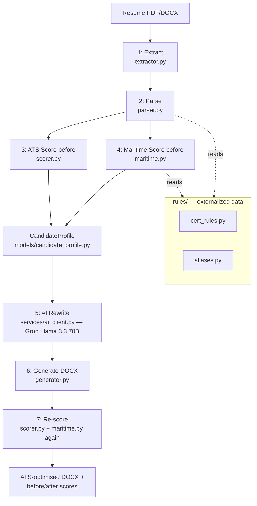

# CLAUDE.md

This file provides guidance to Claude Code (claude.ai/code) when working with code in this repository.

Source of truth for the narrative below: `MYC_ATS_Technical_Architecture.docx` (accurate, validated against 269 real candidate resumes), reconciled with the current codebase after the production-hardening pass described in Task 8's commit history.

## Project Overview

Marine ATS — a resume scoring and rewriting service for Indian seafarer resumes, embedded in Marine Your Career's app via 4 REST endpoints (plus admin/health endpoints).

Indian seafarer resumes are functionally regulatory compliance documents, not marketing documents. Recruiters scan for three things in strict priority order: valid certificates (eligibility gate), unbroken sea service records (verification layer), and vessel type experience (differentiation layer). Most candidates submit Canva-template resumes with multi-column layouts, scattered certification mentions, and no ATS awareness — these get auto-rejected by manning agency screening software before a human ever reads them.

The system ingests a raw resume PDF or DOCX, scores it against both general ATS rules and maritime-specific domain rules, rewrites it using an LLM, and outputs a clean, ATS-compliant DOCX — with a measurable before/after score on both scales.

**Validation**: 269 real candidate resumes processed end-to-end, zero pipeline errors. Avg ATS score 63.4→69.1/100, avg maritime score 54.1→70.7 (on the /65 base + /20 bonus scale), resumes with 0 sea-months detected dropped from 56 to 2, ATS FAIL grade count dropped from 82 to 1.

## Architecture

A modular monolith: FastAPI + SQLite (WAL) + `BackgroundTasks` + Groq, single VPS deployment, single client. PostgreSQL/Celery/Redis/multi-tenancy are deliberately deferred, not oversights — see "Explicitly out of scope" below for the specific trigger conditions that would justify revisiting each one; none has been hit.



Only Stage 5 (AI Rewrite) is non-deterministic. Everything else is pure rules and math — every point gained or lost traces to a named rule (`[R1]`–`[R42]`, see issue strings throughout `scorer.py`/`maritime.py`), not a black box.

### Pipeline stages (in `pipeline/`)

| # | Stage | File | What it does | Tech |
|---|---|---|---|---|
| 1 | Extract | `pipeline/extractor.py` | Reads PDF/DOCX, detects two-column layouts, reconstructs reading order using word x/y coordinates. Flags structural ATS violations (tables, headers/footers, images, scanned PDFs). | pdfplumber, python-docx |
| 2 | Parse | `pipeline/parser.py` | Extracts name, contact, sections, skills, rank. Pulls sea-service months from PDF service-record tables (`extract_sea_months`), with a text-based fallback (`extract_sea_months_from_text`) for when there's no PDF — e.g. re-scoring a generated DOCX. | spaCy (`en_core_web_lg`), regex, `python-dateutil` |
| 3 | ATS Score | `pipeline/scorer.py` | Format (40 pts) + Sections (20 pts) + Keywords (40 pts, blended TF-IDF + raw coverage). | scikit-learn TF-IDF, cosine similarity |
| 4 | Maritime Score | `pipeline/maritime.py` | Domain rules: cert requirements per rank, sea-service minimums, vessel-type match, bonus differentiation tier (0-20 pts). Rule tables live in `rules/`, not here. | Custom rule engine over `rules/cert_rules.py`, `rules/aliases.py` |
| 5 | AI Rewrite | `services/ai_client.py` | LLM rewrites summary, bullets, skills, certs to ATS spec. Raw-text fallback for garbled resumes. Retries transient Groq failures (timeout/rate-limit/connection) with exponential backoff (1s/2s/4s). Output validated, never trusted blindly. | Groq API (Llama 3.3 70B) |
| 6 | Generate | `pipeline/generator.py` | Builds a clean single-column DOCX (Arial, no tables, no images, no text boxes). | python-docx |
| 7 | Re-score | `pipeline/scorer.py` + `pipeline/maritime.py` again | Re-runs both scorers on the generated DOCX to confirm the rewrite actually improved things — this is the loop that the maritime re-score bug (see "Known-fixed bugs" below) broke before it was fixed. | — |

**Entry points:**
- `main.py` — CLI, single resume: `venv/bin/python main.py <resume_path> [job_description]`. Still the manual single-resume testing path; every change in this repo must keep it working.
- `api.py` — FastAPI service, the production path MYC's app calls.
- `pipeline/batch_processor.py` — batch-processes a list of local resumes (`data/resume_file_list.txt`) for regression testing against the 269-resume validation set. Outputs `data/outputs/batch_results.csv` / `.json`.
- `training/prelabel.py` — offline pre-labeling tool (Ollama/qwen2.5:7b) used to build training data for a possible future custom NER model (see Roadmap). Not part of the live pipeline.

### Folder structure

```
.
├── api.py                    # FastAPI service — the 4+ REST endpoints MYC's app calls
├── main.py                   # CLI entry point for manual single-resume testing
├── config.py                 # API keys, model names, scoring weights/thresholds — single source
├── pipeline/                 # Stage-execution layer — extract, parse, score, maritime, generate, batch
│   ├── extractor.py
│   ├── parser.py
│   ├── scorer.py
│   ├── maritime.py
│   ├── generator.py
│   └── batch_processor.py
├── models/
│   └── candidate_profile.py  # CandidateProfile — the typed domain object (see below)
├── services/
│   └── ai_client.py          # Sole Groq import site for the rewrite pipeline (health check pings Groq separately — see below)
├── rules/                    # Externalized maritime rule tables (data, not logic)
│   ├── cert_rules.py         # CERT_REQUIREMENTS, SEA_SERVICE_MIN
│   └── aliases.py            # RANK_KEYWORDS, CERT_ALIASES
├── tests/                    # pytest — scorer.py and maritime.py coverage
├── training/
│   └── prelabel.py           # Offline NER training-data prep, not part of the live pipeline
├── data/                     # gitignored — test_resumes/, outputs/, jobs.db, maritime_skills.json
├── deploy.sh                 # Production deploy script (see "Deployment" below)
├── env_template.txt          # Copy to .env and fill in — see "Environment variables" below
├── crontab_example.txt       # Nightly /ats/cleanup cron entry
└── requirements.txt
```

`pipeline/` stays the stage-execution layer; it does not import from `models/`, `services/`, or `rules/` beyond what the rule tables and generic types require. New pipeline-adjacent logic goes in `models/`, `services/`, or `rules/`, not into `pipeline/` directly — this is a deliberate, settled decision, not an oversight (see the architecture doc's "no further layout debate" framing).

### Domain model: `CandidateProfile`

`models/candidate_profile.py` defines `CandidateProfile` (Pydantic) — the canonical typed object for a candidate, built once per job right after Stage 4 (maritime scoring) via `build_candidate_profile(parsed, maritime_result)`:

```python
class CandidateProfile(BaseModel):
    name: str
    contact: ContactInfo
    rank_detected: str
    license_rank: str
    sea_months: int
    certificates: list[str]
    missing_certs: list[str]
    vessel_types: list[str]
    skills: list[str]
    sections: dict[str, str]
```

Stage 5 (rewrite) and the name/contact injection before Stage 6 (generate) read `rank_detected`, `license_rank`, `name`, and `contact` from this object rather than re-deriving them from the loose `parsed`/`maritime` dicts. This is the boundary where the maritime re-score bug (below) lived — Pydantic validation at construction is a write-time check against malformed upstream data, not just something caught by manual score audits.

It is **not** force-fit everywhere: `rewrite_resume()`'s internal signature still takes `parsed` directly (it needs `parsed['raw_text']` for the raw-fallback prompt path, which isn't part of the `CandidateProfile` schema), and `generate_docx()` is unchanged. Extending `CandidateProfile` further should happen only where it removes a real duplication, not speculatively.

### Rule tables (`rules/`)

`CERT_REQUIREMENTS` and `SEA_SERVICE_MIN` (rank → required certs / minimum sea-service months) live in `rules/cert_rules.py`. `RANK_KEYWORDS` and `CERT_ALIASES` (fallback rank-detection keywords, certificate-name alias lists) live in `rules/aliases.py`. Plain Python dicts, not YAML/JSON — that migration is only worth it once these are actually being edited by non-engineers.

**Do not change point values or thresholds in `config.py`, `pipeline/scorer.py`, or `pipeline/maritime.py` without flagging it first** — they were tuned against the 269-resume validation set. If a rule table in `rules/` needs a value change, run `pipeline/batch_processor.py` against the validation set afterward and compare `data/outputs/batch_results.csv` before/after.

## Commands

```bash
# Run the ATS pipeline on a single resume (CLI)
venv/bin/python main.py <resume_file_path> [job_description]

# Example with a custom job description
venv/bin/python main.py data/test_resumes/ShreyaBansal_Resume_v2.pdf "Seeking Python developer with FastAPI experience"

# Batch-process the validation set (regression check after any rules/ or scoring change)
venv/bin/python pipeline/batch_processor.py

# Run the API locally
venv/bin/uvicorn api:app --reload --port 8000

# Run tests
venv/bin/python -m pytest tests/
```

## Scoring engine design

Two independent scorers run on every resume.

**ATS Score — /100** (`pipeline/scorer.py`)
- **Format (40 pts)**: single-column layout, no tables/images, standard fonts, contact parseability, no special characters, active voice, quantified achievements. `score_format()`.
- **Sections (20 pts)**: presence and quality of Summary, Experience, Education, Skills, Certifications. `score_sections()` checks **both** `parsed['sections']` and a raw-text heading scan — the raw-text path exists specifically so re-scoring a generated DOCX (Stage 7, no `parsed` dict available in the same shape) still works. Both paths are covered in `tests/test_scorer.py`.
- **Keywords (40 pts)**: blended score — 70% weight on raw JD-keyword coverage (stopword-filtered), 30% weight on TF-IDF cosine similarity. Pure cosine under-scores short JDs against long resumes; pure keyword-count over-rewards stuffing. `score_keywords()`.

**Maritime Score — /65 base + /20 bonus** (`pipeline/maritime.py`)
- **Certificate coverage (25 pts)**: rank-specific requirement table (`rules/cert_rules.py`) — e.g. Third Officer needs CoC + STCW + ENG1, Chief Officer additionally needs GMDSS. Alias matching (`rules/aliases.py`) handles real-world phrasing variance — INDOS/CDC numbers count as ENG1 proxies, since Indian seafarers' resumes rarely state "ENG1" explicitly but registration implies it.
- **Sea service (20 pts)**: `estimate_sea_service()` — extracted from the PDF's service-record table first (sign-on/sign-off date pairs, most reliable), falling back to regex MM/YYYY date-range parsing against `parsed['sections']['experience']` when there's no PDF to read (re-scoring a generated DOCX, or a DOCX was uploaded originally). Never silently zeroes out — see "Known-fixed bugs."
- **Vessel type match (10 pts)** and **rank detection (10 pts)**.
- **Bonus tier (0-20 pts)**: differentiates candidates who all hit the scoring ceiling — sea-service depth beyond minimum, vessel-type diversity, full cert coverage, senior-rank premium. Without this, a large share of candidates cluster at the same maximum score with no way to rank them.

An unrecognized rank (not a `KeyError`) falls back to `['STCW', 'ENG1']` required certs and a 6-month minimum via `.get(rank, default)` throughout — this is intentional graceful degradation, covered in `tests/test_maritime.py`.

## AI rewriting (`services/ai_client.py`)

Groq API, Llama 3.3 70B (`config.GROQ_MODEL`). Three safety layers, none of which trust the LLM blindly:
1. **Raw-text fallback** triggers when parsed sections are too thin (common on heavily-garbled two-column resumes) — sends the LLM unprocessed text to reconstruct from instead.
2. **Post-generation validation** (`api.py::_validate_rewrite_output`) checks for placeholder text, empty sections, low skill counts, missing summary.
3. **Deterministic minimum-quality patch** (`enforce_minimum_quality`) pads skill lists and fixes certificate formatting without ever inventing facts.

**Retry/backoff**: `_call_groq_with_retry()` retries `APIConnectionError`, `APITimeoutError`, and `RateLimitError` with exponential backoff (1s/2s/4s, 3 retries) before giving up. Non-transient errors (auth, bad request) propagate immediately — retrying those would just waste time before failing the same way. The existing JSON-parse retry loop in `rewrite_resume()` is separate and unchanged. Retry count is threaded back via `result['_groq_retry_count']` and consumed by `api.py`'s metrics recording (popped off before the dict is used further).

**`MARITIME_JDS` is permanent, not a fallback.** Seafarers submit one resume to many manning agencies/vessels rather than tailoring per posting — there is no per-candidate job description to ever collect. `target_rank` (an optional `/ats/submit` form field) plus rank-detection is the complete feature; there is no "supply your own JD" path, and none should be added without an explicit product decision from MYC. Consequence worth remembering: the keyword-match sub-score always measures fit against a generic rank template, never a specific job posting — that's the intended ceiling of that metric, not a limitation to work around.

Note: `api.py`'s `/health/deep` endpoint does its own lightweight `from groq import Groq` connectivity ping, independent of `services/ai_client.py` — a minimal, isolated use for health-checking, not a second pipeline-logic import site.

## API reference (`api.py`)

All endpoints except `/` and `/health` require an `X-API-Key` header matching `MYC_API_KEY`.

| Method | Path | Purpose |
|---|---|---|
| GET | `/` | Service info, links to docs/health |
| POST | `/ats/submit` | Upload a PDF/DOCX resume (+ optional `job_description`, `target_rank`). Returns `job_id` immediately; processing runs in `BackgroundTasks`. Dedup by SHA-256 within 24h. |
| GET | `/ats/status/{job_id}` | Poll every 2-3s: `queued`/`processing`/`done`/`failed`, `progress`, `current_stage`. |
| GET | `/ats/result/{job_id}` | Full before/after ATS + maritime scores and grades, issues, recommendations, missing certs, keyword data, download URL. |
| GET | `/ats/download/{job_id}` | Downloads the optimised DOCX. 410 if past the 48h TTL. |
| DELETE | `/ats/job/{job_id}` | Deletes the job record and output files — GDPR right-to-erasure. |
| POST | `/ats/cleanup` | Deletes all jobs past their TTL. Wire to cron (see `crontab_example.txt`). |
| GET | `/ats/admin/metrics` | Aggregate stats — see "Observability" below. |
| GET | `/health` | No auth. Disk space + job count, for load balancers. |
| GET | `/health/deep` | Auth required. Groq connectivity ping + DB + disk checks, for monitoring alerts. |

`/ats/result/{job_id}` returns `maritime_score_before`/`maritime_grade_before` and `maritime_score_after`/`maritime_grade_after` as distinct, independently-computed values (plus `maritime_score`/`maritime_grade` back-compat aliases pointing at the before-value) — see "Known-fixed bugs."

## Observability

Structured JSON logging throughout (`api.py`'s `PiiFilter` + `stage()` pattern) — strips email/phone/passport/CDC/INDOS patterns from every log line before it's written. Extended (not replaced) with:
- **Per-stage duration**: the `stage()` closure in `run_pipeline()` times each stage and logs+records it when the next stage starts (or the job finishes/fails).
- **Groq retry count per job** and a **running Groq failure count**, via an in-memory `_Metrics` counter (thread-safe).

`GET /ats/admin/metrics` returns: jobs processed/done/failed and avg ATS/maritime score deltas (from the `Job` table — durable, accurate across the whole process's history), plus Groq call/retry/failure counts and avg stage durations (from the in-memory counters).

**Caveat, stated in the response itself**: the in-memory figures reset on process restart and are **not** aggregated across `uvicorn --workers 2` — each worker process has its own counters. The Job-table figures (jobs processed, score deltas) are accurate process-wide since they hit the shared SQLite DB. If per-worker metrics fragmentation becomes a real problem, that's a trigger to revisit — not before.

## Environment variables

Copy `env_template.txt` to `.env` (never commit `.env`).

| Variable | Required | Default | Notes |
|---|---|---|---|
| `MYC_API_KEY` | Yes | — | Shared-secret auth for every `X-API-Key`-protected endpoint. Generate with `openssl rand -hex 32`. Service refuses all requests (503) if unset. |
| `GROQ_API_KEY` | Yes | — | Groq API key for the rewrite stage and `/health/deep`. **Rotate this** if it was ever present in an uploaded audit zip or committed by mistake — check `git log -p -- '*.env'` and any archived exports. |
| `MAX_FILE_MB` | No | `5` | Upload size limit. |
| `JOB_TTL_HOURS` | No | `48` | How long output files + job records are retained before `/ats/cleanup` deletes them. This is the PII retention boundary — do not extend without a data-retention reason, and don't add long-term storage of intermediate pipeline stages (extracted text, raw parses) elsewhere either; structured logging covers debugging needs. |
| `TMP_DIR` | No | `/tmp/ycm-ats` | Scratch space for uploaded files before/during processing. |
| `ALLOWED_ORIGINS` | No | `*` | CORS allow-list, comma-separated. |

`config.py` also defines (not env vars — code constants, tuned against the validation set, don't change without flagging): `GROQ_MODEL` (`llama-3.3-70b-versatile`), `FORMAT_WEIGHT`/`SECTION_WEIGHT`/`KEYWORD_WEIGHT` (40/20/40), and `SCORE_EXCELLENT`/`SCORE_GOOD`/`SCORE_PASS` (85/75/60).

## Deployment

`deploy.sh` (tested on Ubuntu 22.04, Python 3.11) does the following — run it on the target VPS:

1. Creates/activates `venv/`, installs `requirements.txt`.
2. Downloads the spaCy `en_core_web_lg` model if not already present (large — several hundred MB; this step is slow on first deploy).
3. Verifies `.env` exists and `MYC_API_KEY` has actually been changed from the placeholder — refuses to start otherwise.
4. Creates `data/outputs/` and the tmp upload dir.
5. Starts `uvicorn api:app` with 2 workers, bound to `0.0.0.0:8000`.

Manual steps `deploy.sh` does **not** cover:
- Putting a reverse proxy (nginx/Caddy) in front of port 8000 for TLS — this repo assumes ngrok or a VPS-level proxy handles that; it's not baked into `deploy.sh`.
- Installing the nightly cleanup cron job — see `crontab_example.txt`; add it with `crontab -e` on the deploy target, pointing `X-API-Key` at the real `MYC_API_KEY`.
- Restarting on boot / process supervision (systemd unit, pm2, supervisor) — not included; pick whichever your VPS provider's convention is, since none is currently checked in.
- Sharing the API key + endpoint URL with MYC's developer once deployed.

Re-running `deploy.sh` is safe (idempotent): it won't re-download the spaCy model if present, and won't overwrite an existing `.env`.

## Backup / restore — `data/jobs.db`

`data/jobs.db` is SQLite in WAL mode. The `Job` table holds no raw resume text/PII beyond what's listed in `env_template.txt`'s TTL note (name/rank/sea-months/cert-coverage metadata, not full parsed content) and expires via `/ats/cleanup`, so this is operational-continuity backup, not a PII archive.

**Backup** (safe to run while the API is live, WAL mode handles concurrent readers):
```bash
sqlite3 data/jobs.db ".backup data/jobs.db.bak"
```
Avoid a plain `cp` while the server is running — WAL mode means `jobs.db-wal`/`jobs.db-shm` may hold uncommitted state that a raw file copy won't capture consistently; `.backup` handles this correctly.

**Restore**:
```bash
# Stop the API first
cp data/jobs.db.bak data/jobs.db
rm -f data/jobs.db-wal data/jobs.db-shm   # stale WAL/SHM from the old process, if present
# Restart the API
```

**Output files** (`data/outputs/{job_id}/`) are not part of the DB backup — if you need to preserve in-flight download links across a restore, back up `data/outputs/` alongside `jobs.db` before the TTL sweep runs. Given the 48h TTL, this is rarely worth doing outside of active incident recovery.

## Troubleshooting

**Groq is down / timing out**
- `/health/deep` will report `"groq": "error: ..."` — check this first before assuming a job-level bug.
- Individual jobs retry transient failures automatically (1s/2s/4s backoff, 3 retries — see "AI rewriting" above). A sustained outage still surfaces as `rewritten['error'] == 'API_CALL_FAILED'` after retries exhaust; `run_pipeline()` falls back to preserving the original content rather than failing the whole job (`issues_fixed: ['AI rewrite unavailable — original content preserved']`), so candidates still get a DOCX, just without the AI rewrite.
- Check `GET /ats/admin/metrics` → `groq_failure_rate` to see whether this is one job or a pattern.

**Disk full**
- `/ats/submit` checks free disk space up-front (`MIN_DISK_FREE_MB = 200`) and returns `507 Insufficient disk space` rather than accepting an upload it can't process.
- `/health` and `/health/deep` report `disk_free_mb`/`disk_ok` — wire an alert to these.
- Most likely cause: `/ats/cleanup` isn't actually running on cron (check `crontab_example.txt` is installed) — expired job output isn't being swept. `data/outputs/` and `TMP_DIR` are the two places to check disk usage first.

**Malformed or scanned (image-only) resume upload**
- `pipeline/extractor.py::extract_pdf` returns `structural_issues: ['SCANNED_PDF_DETECTED_OCR_NEEDED']` when extracted text is under 100 characters — this isn't a crash, it's a low-confidence signal that scores very low on Format (-15 pts) and likely fails downstream sections/keyword scoring too, but the job still completes.
- A genuinely corrupt/unreadable file raises inside `extract_pdf`/`extract_docx` and is caught, returning `structural_issues: ['PDF_READ_ERROR: ...']` / `['DOCX_READ_ERROR: ...']` — again, not a job crash.
- `run_pipeline()` only hard-fails the job (`status: 'failed'`) if `extracted['raw_text']` is completely empty after extraction (`ValueError('Could not extract text...')`) — check `job.error_detail` via `/ats/status/{job_id}` for this case.
- OCR itself is out of scope — there's no OCR fallback pipeline; a scanned PDF is flagged, scored low, and left to the candidate to fix (re-upload a text-layer PDF).

**Job stuck in `processing`**
- Since `BackgroundTasks` runs in-process (no separate worker/queue — see "Architecture"), a job stuck in `processing` almost always means the worker process died mid-job (OOM, crash, manual restart) without reaching the `except`/`finally` block that would mark it `failed`.
- There is currently no automatic sweeper that requeues or times out stuck jobs (a known open item — whether a monitoring/requeue system exists elsewhere or needs building is still an unresolved product/eng decision, not something to build speculatively here). Until that's resolved: identify stuck jobs with `SELECT job_id, current_stage, created_at FROM jobs WHERE status='processing' AND created_at < datetime('now', '-1 hour')`, and either manually mark them `failed` via a one-off script or delete them via `DELETE /ats/job/{job_id}` so the candidate can resubmit.
- Check server logs around the job's `job_id` for the last stage it reached (`"stage":"..."` log lines) to diagnose which pipeline stage hung.

## Testing

`tests/test_scorer.py` and `tests/test_maritime.py` — pure-function coverage for the two highest-value, lowest-I/O files. Run with `venv/bin/python -m pytest tests/`. Not chasing full coverage; these two files were prioritized because they're pure functions with no I/O and carry the tuned scoring logic that must not silently regress.

After any change to `rules/`, `pipeline/scorer.py`, or `pipeline/maritime.py`: run the test suite, then run `pipeline/batch_processor.py` against the real validation set (`data/resume_file_list.txt`, gitignored — populated locally, not in this repo) and diff `data/outputs/batch_results.csv` against a pre-change baseline.

## Known-fixed bugs (worth knowing the history of)

- **Maritime re-score bug**: `maritime_score_after` used to be a copy-paste of `maritime_score_before` — Stage 7 never actually re-ran the maritime scorer on the rewritten output. Fixed by re-running `maritime_score()` on the regenerated DOCX and storing the result separately. This also surfaced a second bug: `estimate_sea_service()` only read sea months from a PDF path, so re-scoring a DOCX (no PDF) silently zeroed sea months out. Fixed with a text-based fallback (`extract_sea_months_from_text`) that parses the same MM/YYYY date-range pattern directly from `parsed['sections']['experience']`.
- **`stamper.py` removed permanently**: it applied an MYC watermark by converting the generated DOCX to PDF and overlaying an image — which violates the pipeline's own rule against graphics/images on the ATS-facing document (R7) and would degrade the score the pipeline just optimised. It was never called from `api.py` or `main.py` even before removal; this was dead code cleanup, not a behavior change.

## Explicitly out of scope (revisit only on a real trigger, not preference)

- Celery/Redis job queue — until concurrent long-running jobs measurably queue/block on `BackgroundTasks`.
- PostgreSQL — until SQLite WAL's safe concurrency ceiling is actually hit.
- Multi-tenancy, billing, OAuth, SDKs — no measured need; one client, one developer.
- A second AI provider / generic AI-provider abstraction — until a real second use-case requires it.
- Per-candidate job description upload — `MARITIME_JDS` rank templates are permanent by design (see "AI rewriting" above), not a stopgap.
- OCR for scanned resumes — flagged and scored low, not auto-corrected.

## Roadmap

- Custom spaCy NER model fine-tuned on the growing resume corpus — replaces regex-based rank/cert/vessel extraction once the labeled dataset is large enough and the rules-based approach demonstrably underperforms it. `training/prelabel.py` is the current data-prep step toward this.
- Placement-outcome prediction once 500+ MYC placement records accumulate.
- PostgreSQL + Celery/Redis migration, if/when concurrent load exceeds SQLite WAL's safe ceiling.
- Human-in-the-loop review queue for resumes flagged by output validation before delivery to candidates.
